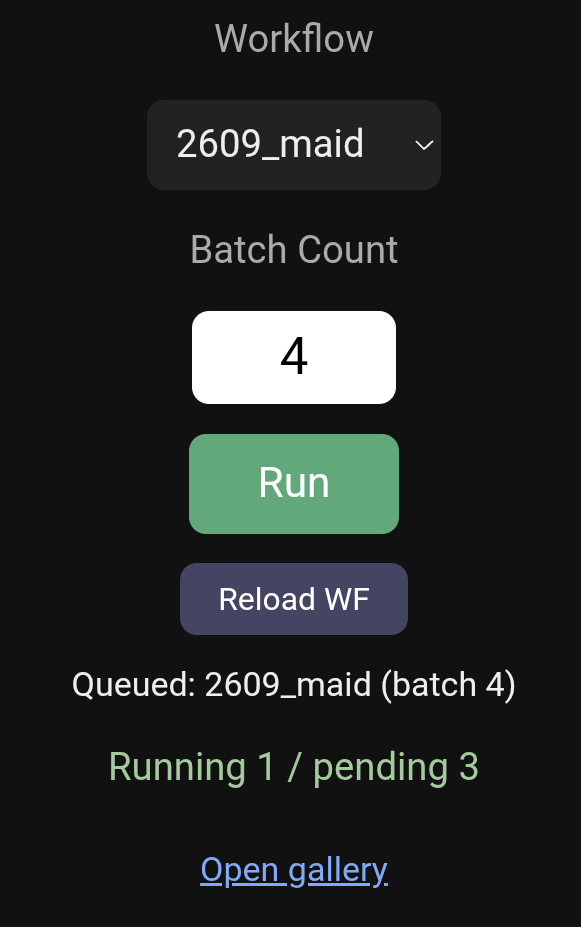

# ComfyUI Mobile Relay

[English](README.md) | [日本語](README_ja.md)

A small relay server that lets you run ComfyUI on your home PC from your phone:
pick a saved workflow, set how many times to run it, hit Run. Results can be
browsed in a simple gallery.

ComfyUI itself is never exposed to the network — only this relay server is, and
it is meant to be reached over a private network (Tailscale).

## Why this approach

You can publish ComfyUI with `--listen` and open it from your phone, but what
you get is the same node graph as on the desktop, which is not realistic to
operate by touch. There are mobile-oriented alternative frontends, but they do
not guarantee custom node compatibility, and there is no guarantee that
behaviour depending on the official frontend's JS — seed `control_after_generate`,
wildcard populate handling — is reproduced.

More to the point: would I really do involved graph editing on a phone while out?
No. If I need that, I'll remote into the PC from a laptop. So editing was cut
entirely. Combine Random-family nodes and wildcards and a single fixed workflow
still gives plenty of variation.

This tool runs **the official frontend as-is** in a headless browser on the PC,
hands the workflow to ComfyUI's own loader, and presses Queue. All of ComfyUI's
own JS runs, so seeds and wildcards behave exactly as they do normally.

## ⚠️ Important security note

**This server has no authentication whatsoever.** Anyone who can reach it can
run generations and browse your outputs.

- **Only use it inside a private network such as Tailscale**
- **Do not port-forward it or expose it directly to the internet**
- Keep ComfyUI listening on `127.0.0.1` only; don't use `--listen 0.0.0.0`

Over Tailscale, joining the tailnet requires account authentication, so in
practice that step already acts as your authentication.

## Tested environment

- Windows 11 (should work on Linux/macOS, untested)
- ComfyUI v0.34.0
- Python 3.11+




## How it works

```
Phone ──(Tailscale)──> Relay server (8080) ──(127.0.0.1)──> ComfyUI (8188)
                            │
                            └─ A headless Chromium keeps ComfyUI open
```

ComfyUI only listens on loopback, so all the phone can see is the relay's simple
screen.

Instead of clicking through the Workflows sidebar, the relay reads the .json
straight from disk and hands it to ComfyUI's own loader:

```js
window.app.loadGraphData(graphData)
```

This is the same function the sidebar ends up calling, so everything the frontend
normally does — widgets, custom nodes, seed and wildcard handling — still happens.
Going through the API instead of the DOM avoids a long list of problems: sidebar
open/closed state, folder expand/collapse, virtualized scrolling, the search box,
name collisions between the tab bar and the tree, and the fact that the sidebar's
workflow list is only fetched once per page load.

Only two things are still driven through the DOM: the Batch Count field and the
Queue button.

## Repository layout

```
comfyui-mobile-relay/
├── relay_server.py       # the whole server (single file)
├── requirements.txt
├── start_relay.bat       # convenience launcher for Windows
├── LICENSE
├── README.md
├── README_ja.md
└── images/
    ├── main.webp
    └── gallery.webp
```

## Setup

```bash
pip install -r requirements.txt
playwright install chromium
```

Adjust the settings at the top of `relay_server.py` (or set them as environment
variables) to match your environment.

| Variable | Meaning | Default |
|---|---|---|
| `COMFYUI_URL` | ComfyUI's URL | `http://127.0.0.1:8188` |
| `COMFYUI_ROOT` | ComfyUI install directory | `C:\ComfyUI_windows_portable\ComfyUI` |
| `COMFYUI_OUTPUT_DIR` | Output folder | `<COMFYUI_ROOT>\output` |
| `MOBILE_FOLDER` | Folder holding the workflows to offer | `mobile` |
| `REOPEN_SAME_WORKFLOW` | `1` re-reads from disk on every run | `0` |
| `ACTION_TIMEOUT_MS` | Timeout for individual UI actions | `8000` |
| `NAV_TIMEOUT_MS` | Timeout for page navigation | `30000` |
| `UI_READY_TIMEOUT_MS` | How long to wait for the UI to become usable | `45000` |
| `HEADLESS` | `0` shows the browser window (for debugging) | `1` |

### ⚠️ Turn off workflow auto save

ComfyUI settings (gear) → Workflow → **turn Auto Save off.**

With it on, running a workflow rewrites its JSON file.

### Place the workflows you want to run

Save them under `<COMFYUI_ROOT>\user\default\workflows\mobile\` in the normal
format (NOT the API format). In Graph mode, use Save As with a name like
`mobile/xxx` and it lands in that folder.

Whatever is in there shows up in the dropdown on the phone.

## Running

```bash
uvicorn relay_server:app --host 0.0.0.0 --port 8080
```

On Windows, `start_relay.bat` does the same thing with a double click.

## Exposing it over Tailscale

Check the PC's Tailscale IP:

```powershell
tailscale ip -4
```

In an elevated PowerShell, allow port 8080 from the Tailscale address range only:

```powershell
New-NetFirewallRule -DisplayName "ComfyUI Relay 8080" -Direction Inbound -LocalPort 8080 -Protocol TCP -Action Allow -Profile Any -RemoteAddress 100.64.0.0/10
```

With the Tailscale app on your phone joined to the same tailnet, open
`http://<PC's Tailscale IP>:8080/` or `http://<machine name in Tailscale>:8080/`.
Add it to your home screen and it behaves like an app.

## Usage

1. Pick a workflow from the dropdown
2. Enter Batch Count (the run count next to Queue — not a node's Batch Size)
3. Press Run
4. The queue length is shown; check the gallery once generation finishes

You can add to the queue while a generation is running. It joins the same queue
as anything started on the PC and is processed in order.

### The Reload WF button

Press it **after editing, on the PC, the workflow that is currently loaded.**

When the same workflow is run repeatedly, the load is skipped. Re-reading from
disk would reset every widget to its saved value, including seeds — and with
`control_after_generate` set to `increment` or `fixed` that would make every run
produce the same result. Skipping preserves the seed progression exactly as it
behaves for a person clicking Run repeatedly.

Switching to a different workflow always re-reads from disk, so a stale copy only
matters for the workflow that is currently loaded.

## Endpoints

| Path | Purpose |
|---|---|
| `GET /` | Phone UI |
| `GET /workflows` | Workflows found in the target folder |
| `POST /run?workflow=<name>&count=<n>` | Run |
| `GET /status` | Queue length (running / pending) |
| `POST /reload` | Reload the page and force a fresh read on the next run |
| `GET /gallery` | Output images (newest first, subfolders included) |
| `POST /stop` | Shut down the headless browser (auto-restarts on next run) |
| `GET /debug/state` | Current workflow name, page title, node count |
| `GET /debug/screenshot` | Screenshot of the headless browser |

The `/run` response tells you what happened:

```json
{
  "workflow": "asuna",
  "load": { "loaded": true, "reused": false, "nodes": 253, "expected": 253 },
  "batch_count_in_ui": "2",
  "queue_before": 10,
  "queue_after": 12,
  "queued": true
}
```

If `nodes` matches `expected`, every node in the JSON was loaded. On repeated runs
of the same workflow you'll see `reused: true`, meaning the load was skipped.

## Troubleshooting

### The phone can't connect

Work through these in order:

1. **Is the server bound to `0.0.0.0`?** The uvicorn console should say
   `Uvicorn running on http://0.0.0.0:8080`. If it still says `127.0.0.1`,
   nothing outside the PC can reach it.
2. **Can the PC itself open its own Tailscale IP?** Try
   `http://<Tailscale IP>:8080/`.
3. **Read the error carefully.** "Connection refused" means nothing is listening
   (server not running, wrong bind address). A timeout means a firewall is
   dropping the packets.
4. **Check the Tailscale ACL.** In the admin console, confirm it is still the
   default allow-all.

### The firewall allow rule doesn't help

**In Windows Firewall, block rules win over allow rules.** If you ever answered
"Cancel" to the Windows prompt when starting a Python server, an inbound block
rule for `python.exe` is still there. It will keep dropping traffic no matter how
many port-level allow rules you add afterwards.

Check:

```powershell
Get-NetFirewallApplicationFilter | Where-Object { $_.Program -like "*python*" } | ForEach-Object { Get-NetFirewallRule -AssociatedNetFirewallApplicationFilter $_ } | Format-Table DisplayName,Direction,Action,Enabled,Profile -AutoSize
```

If any row shows `Action = Block` and `Direction = Inbound`, that's the culprit.
Disable them (elevated):

```powershell
Get-NetFirewallApplicationFilter | Where-Object { $_.Program -like "*python*" } | ForEach-Object { Get-NetFirewallRule -AssociatedNetFirewallApplicationFilter $_ } | Where-Object { $_.Action -eq "Block" -and $_.Direction -eq "Inbound" } | Disable-NetFirewallRule
```

To confirm the firewall is what's blocking you, turn it off briefly.
**Always turn it back on.**

```powershell
Set-NetFirewallProfile -Profile Domain,Public,Private -Enabled False
# once you've checked
Set-NetFirewallProfile -Profile Domain,Public,Private -Enabled True
```

### No workflows in the dropdown

Check that `MOBILE_FOLDER` points at the right path. The list is read straight
from disk, so files show up without restarting ComfyUI.

### It broke after a ComfyUI update

Only two selectors depend on the DOM. Fixing these should be enough:

| Function | Selector |
|---|---|
| `set_batch_count()` | `get_by_role("textbox", name="Batch Count")` |
| `click_queue()` | `[data-testid="queue-button"]` |

To find the new ones: open ComfyUI in a browser, press F12, use the element
picker (Ctrl+Shift+C), click the control, then right-click → Copy → Copy
outerHTML. Look for `id`, `aria-label` or `data-testid` attributes.

Starting with `HEADLESS=0` lets you watch the automation drive a real browser
window.

It will also break if `window.app.loadGraphData` disappears. Check from the
browser console with ComfyUI open:

```js
typeof window.app?.loadGraphData   // "function" means it's usable
```

## Limitations

- No workflow editing (a deliberate trade-off)
- No authentication (private network assumed)
- The gallery walks the whole output folder each time, so it gets slower as
  images pile up
- Depends on ComfyUI's frontend implementation

## Development notes

Problems hit on the way from a sidebar-clicking implementation to the current
approach. Posted in case anyone attempts the same thing.

**Workflow auto save will corrupt your files.** If a load hasn't finished when
Queue is pressed, ComfyUI can believe workflow A is open while the actual graph
is B. Auto save then writes **B's graph into A's file.** Recoverable, since
generated PNGs carry the workflow, but easy to miss.

**The workflow list is fetched once per page load.** Workflows saved afterwards
do not appear in the sidebar of an already-open page. ComfyUI's `R` key reloads
node definitions (which is what picks up newly added models and LoRAs), not the
workflow list — that needs a browser reload. The current implementation reads
from disk, so this problem is gone.

**`networkidle` never settles during generation.** ComfyUI streams progress over
a WebSocket, so the network is never quiet. `page.reload(wait_until="networkidle")`
is guaranteed to time out mid-generation. Use `domcontentloaded`.

**Answer `beforeunload` with `accept()`.** Changing Batch Count alone marks the
workflow as modified, so a reload triggers the leave-confirmation. `dismiss()`
means "stay on this page", which cancels the reload and hangs until it times out.
Counterintuitive enough to be worth writing down.

**`domcontentloaded` fires long before the UI is usable.** It only means the HTML
was parsed; the Vue app still has to mount, and that's slower during generation.
Don't sleep a fixed amount — wait for a real element to appear.

**Driving the sidebar through the DOM is a minefield.** Detecting folder
expand/collapse state, virtualized scrolling once the list grows, whether a search
box exists, the same name matching in both the tab bar and the tree. Switching to
`window.app.loadGraphData()` threw all of it away at once.

## License

MIT
