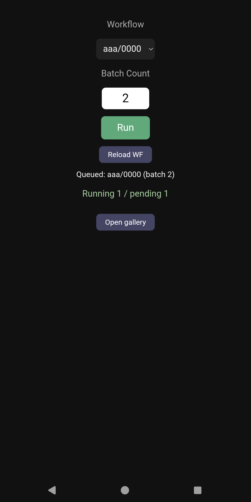
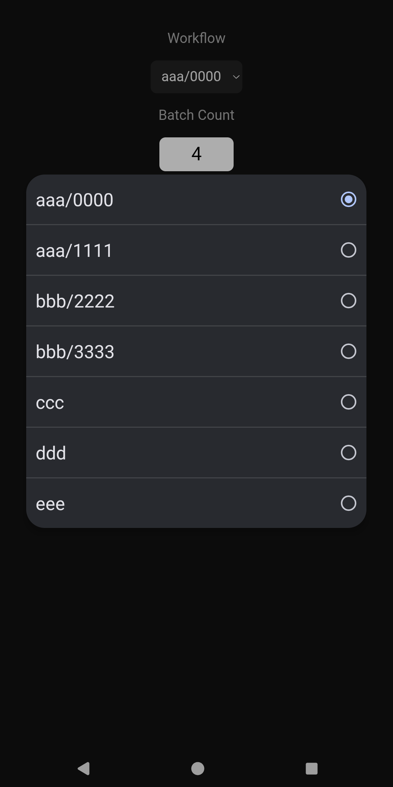

# ComfyUI Mobile Relay

[English](README.md) | [日本語](README_ja.md)

スマホから自宅PCのComfyUIを「ワークフローを選んで、実行回数を指定して、実行する」だけの
シンプルな中継サーバーです。生成結果は簡易ギャラリーで閲覧できます。

ComfyUI本体をネットワークに公開せず、この中継サーバーだけをVPN経由で公開する構成を前提と
しています。



## なぜこの方式にしたか

ComfyUIを `--listen` で公開してスマホから直接開くこともできますが、表示されるのはPCと同じ
ノードグラフ画面で、タッチ操作で扱うのは現実的ではないように思いました。モバイル向けの代替
フロントエンドもありますが、カスタムノードの互換性が保証されず、seedの
`control_after_generate` やwildcardのpopulate処理といった本家フロントエンドのJS実装に依存
する挙動が再現される保証もありません。

また、外出先のスマホでそこまで凝った編集をするかと問われると自分はまずしない、編集までする
ならノートPCで自宅PCにリモートするかな、と思い編集を切り捨てました。Random系ノードや
wildcardを組み合わせればそれなりに振れますので。

このツールは、PC上のヘッドレスブラウザで**本家のフロントエンドをそのまま動かし、ComfyUI自身
のローダーにワークフローを渡してQueueを押す**方式です。ComfyUI本来のJSがすべて動くため、
seedもwildcardも普段と完全に同じ挙動になります。

## ⚠️ セキュリティに関する重要な注意

**このサーバーには認証機構が一切ありません。** 到達できる人は誰でも実行・閲覧できてしまいます。

- **必ずTailscale等のプライベートネットワーク内でのみ使用してください**
- **ポート開放してインターネットに直接公開しないでください**
- ComfyUI本体は `127.0.0.1` のみでリッスンさせ、`--listen 0.0.0.0` は使わない構成を推奨します

Tailscale経由であれば、tailnetへの参加自体がアカウント認証を伴うため、実質的にそこで認証が
済んでいる状態になります。

## 動作検証環境

- Windows 11（Linux/macOSでも動くはずですが未検証）
- ComfyUI v0.34.0
- Python 3.11+

## しくみ

```
スマホ ──(Tailscale)──> 中継サーバー(8080) ──(127.0.0.1)──> ComfyUI(8188)
                              │
                              └─ ヘッドレスChromiumがComfyUIの画面を開いたまま常駐
```

ComfyUI本体はローカルループバックでしか待ち受けないので、スマホから見えるのは中継サーバーの
簡易画面だけです。

ワークフローの読み込みは、サイドバーをクリックする代わりに、ディスクから読んだJSONを
ComfyUI自身のローダーに直接渡しています。

```js
window.app.loadGraphData(graphData)
```

サイドバーが内部で呼んでいるのと同じ関数なので、フロントエンドの処理（ウィジェット、カスタム
ノード、seedやwildcardの扱い）は通常どおり動きます。DOMを経由しないことで、サイドバーの開閉
状態・フォルダ展開・仮想スクロール・検索ボックス・タブバーとの名前衝突・一覧がページ読み込み
時にしか取得されない問題を、まとめて回避しています。

DOMを操作するのは Batch Count の入力欄と Queue ボタンの2箇所だけです。

## フォルダ構成

```
comfyui-mobile-relay/
├── relay_server.py       # サーバー本体（単一ファイル）
├── requirements.txt
├── start_relay.bat       # Windows用の起動バッチ
├── LICENSE
├── README.md
├── README_ja.md
└── images/
    ├── main.webp
    └── gallery.webp
```

## セットアップ

```bash
pip install -r requirements.txt
playwright install chromium
```

`relay_server.py` 冒頭の設定を自分の環境に合わせて変更します。

### 接続・動作

| 変数名 | 内容 | デフォルト |
|---|---|---|
| `COMFYUI_URL` | ComfyUI本体のURL | `http://127.0.0.1:8188` |
| `COMFYUI_ROOT` | ComfyUIのインストール先 | `C:\ComfyUI_windows_portable\ComfyUI` |
| `COMFYUI_OUTPUT_DIR` | 出力フォルダ | `<COMFYUI_ROOT>\output` |
| `MOBILE_FOLDER` | 対象ワークフローを置くフォルダ名 | `mobile` |
| `REOPEN_SAME_WORKFLOW` | `1` にすると毎回ディスクから読み直す | `0` |
| `ACTION_TIMEOUT_MS` | 個々のUI操作のタイムアウト | `8000` |
| `NAV_TIMEOUT_MS` | ページ遷移のタイムアウト | `30000` |
| `UI_READY_TIMEOUT_MS` | UI構築完了を待つ上限 | `45000` |
| `HEADLESS` | `0` にするとブラウザ画面を表示（デバッグ用） | `1` |

### ギャラリーの見た目

| 変数名 | 内容 | デフォルト |
|---|---|---|
| `GRID_MIN_PX` | 一覧の1列あたり最小幅（px）。**列数はここで決まる** | `180` |
| `THUMB_MAX` | 一覧サムネイルの長辺（px） | `400` |
| `THUMB_QUALITY` | 一覧サムネイルのJPEG品質 | `80` |
| `VIEW_MAX` | ビューアー表示用画像の長辺（px） | `1280` |
| `VIEW_QUALITY` | ビューアー表示用画像のJPEG品質 | `85` |
| `SLIDESHOW_SEC` | スライドショーの表示間隔（秒） | `5` |


`THUMB_MAX` は配信するJPEGの解像度であって、一覧の列数とは無関係です。列を減らして1枚を
大きく見せたい場合は `GRID_MIN_PX` を上げてください（`180` でスマホ2列程度）。

### ⚠️ ワークフローの自動保存をoffにする

ComfyUIの設定（歯車）→ Workflow → **Auto Save を off にしてください。**

onのままだと、実行時にワークフローのJSONファイルが書き換えられます。

### 実行したいワークフローを配置する

`<COMFYUI_ROOT>\user\default\workflows\mobile\` に、通常形式（API形式ではない）で保存します。
Graph modeで Save As するとき、名前を `mobile/xxx` のようにスラッシュ区切りにすれば、その
フォルダに保存されます。

サブフォルダも再帰的に拾うので、`mobile/abc/foo.json` は `abc/foo` としてドロップダウンに
並びます。保存時にうっかりサブフォルダを作ってしまっても、一覧を見れば気付けます。



## 起動

```bash
uvicorn relay_server:app --host 0.0.0.0 --port 8080
```

Windowsなら `start_relay.bat` をダブルクリックしても同じです。

## Tailscale経由での公開

PCのTailscale IPを確認します。

```powershell
tailscale ip -4
```

管理者権限のPowerShellで、Tailscaleのアドレス範囲からのみ8080番を許可します。

```powershell
New-NetFirewallRule -DisplayName "ComfyUI Relay 8080" -Direction Inbound -LocalPort 8080 -Protocol TCP -Action Allow -Profile Any -RemoteAddress 100.64.0.0/10
```

スマホのTailscaleアプリで同じtailnetに参加していれば、`http://<PCのTailscale IP>:8080/`
もしくは `http://<Tailscaleに表示のPC名>:8080/` でアクセスできます。ホーム画面に追加すると
アプリのように使えます。

## 使い方

1. ドロップダウンでワークフローを選ぶ
2. Batch Count（Queue横の実行回数。ノードのBatch Sizeではない）を入力
3. Run を押す
4. キュー残数が表示されるので、生成が終わったらギャラリーで確認する

生成中でもキューは追加できます。PC側で実行中のものと同じキューに並び、順番に処理されます。

### Reload WF ボタン

**今開いているワークフローをPC側で編集した場合**に押します。

同じワークフローを連続実行する場合は読み込みをスキップしています。ディスクから読み直すと
seedを含む全ウィジェットが保存時の値に戻り、`control_after_generate` が `increment` や
`fixed` だと毎回同じ結果になってしまうためです。人が繰り返しRunを押したときと同じseedの
進み方を保つ、という意図です。

別のワークフローに切り替えれば必ずディスクから読み直すので、古いままになるのは「今開いて
いるワークフローを編集した」場合だけです。

## ギャラリー

出力フォルダ配下を再帰的に走査し、**更新日時の新しい順に一括表示**します。ワークフロー側で
`%date:yyMM%` のように月別サブフォルダへ振り分けていても、フォルダの区切りを意識せず時系列で
流し見できます。これが思いのほか便利で、生成直後の確認ならエクスプローラーでフォルダを
行き来するより早いです。

サムネイルをタップすると、別タブではなく**ページ内のフルスクリーンビューアー**が開きます。

| 操作 | スマホ | PC |
|---|---|---|
| 次/前へ | 左右スワイプ、画面端タップ | 左右矢印キー、画面端クリック |
| 閉じる | 下スワイプ、右上の × | Esc、右上の × |
| スライドショー | ▶ボタン | ▶ボタン、スペースキー |


- 端まで行くと反対側へ折り返します
- 表示は `VIEW_MAX` にリサイズした画像なので、モバイル回線でも軽く送れます。前後1枚を先読み
  するので連続でめくっても待ちが出にくいです
- 原寸が必要なときは下部の「Open original」から。保存もここから、あるいは表示中の画像を
  長押しでできます

スマホ専用ではないので、**母艦PCのブラウザからも同じURLで開けます**
（`http://127.0.0.1:8080/gallery`）。矢印キーとスペースキーが使えるぶん、PCの方が流し見は
快適かもしれません。

## エンドポイント

| パス | 内容 |
|---|---|
| `GET /` | スマホ用の操作画面 |
| `GET /workflows` | 対象フォルダ内のワークフロー一覧（サブフォルダ含む） |
| `POST /run?workflow=<名前>&count=<回数>` | 実行 |
| `GET /status` | キュー残数（実行中/待機） |
| `POST /reload` | ページを再読み込みし、次回実行時にディスクから読み直させる |
| `GET /gallery` | 出力画像の一覧＋ビューアー（更新日時の新しい順、サブフォルダ含む） |
| `GET /thumb/<相対パス>` | 一覧用サムネイル |
| `GET /view/<相対パス>` | ビューアー用のリサイズ画像 |
| `GET /full/<相対パス>` | 原寸のオリジナル |
| `POST /stop` | ヘッドレスブラウザを終了（次回実行時に自動再起動） |
| `GET /debug/state` | 今保持しているワークフロー名・タイトル・ノード数 |
| `GET /debug/screenshot` | ヘッドレスブラウザの画面キャプチャ |

`/run` のレスポンスで動作を確認できます。

```json
{
  "workflow": "asuna",
  "load": { "loaded": true, "reused": false, "nodes": 253, "expected": 253 },
  "batch_count_in_ui": "2",
  "queue_before": 10,
  "queue_after": 12,
  "queued": true
}
```

`nodes` と `expected` が一致していればJSONのノードが全て読み込まれています。同じワークフロー
の連続実行時は `reused: true` になり、読み込みがスキップされたことを示します。

## トラブルシューティング

### スマホから繋がらない

切り分けの順序：

1. **サーバーが `0.0.0.0` で起動しているか。** uvicornのコンソールに
   `Uvicorn running on http://0.0.0.0:8080` と出ているか確認する。`127.0.0.1` のままだと
   外部からは到達できません
2. **PC自身から自分のTailscale IPで開けるか。** `http://<Tailscale IP>:8080/` を試す
3. **エラーの種類を見る。** 「接続が拒否されました」は待ち受けているプロセスがいない
   （サーバー未起動、バインド設定の誤り）。「応答時間が長すぎます」（タイムアウト）は
   ファイアウォールでブロックされている
4. **Tailscale ACLを確認する。** 管理コンソールでデフォルトの全許可のままか確認

### ファイアウォールの許可ルールを作ったのに繋がらない

**Windowsファイアウォールではブロックルールが許可ルールより優先されます。** 過去にPythonで
サーバーを立てた際、Windowsのダイアログで「許可しない」を選んでいると、`python.exe` に対する
Inbound Blockルールが残っています。これがあると、後からポート単位の許可ルールを追加しても
弾かれ続けます。

確認：

```powershell
Get-NetFirewallApplicationFilter | Where-Object { $_.Program -like "*python*" } | ForEach-Object { Get-NetFirewallRule -AssociatedNetFirewallApplicationFilter $_ } | Format-Table DisplayName,Direction,Action,Enabled,Profile -AutoSize
```

`Action` が `Block` で `Direction` が `Inbound` の行があれば、それが原因です。無効化します
（管理者権限）：

```powershell
Get-NetFirewallApplicationFilter | Where-Object { $_.Program -like "*python*" } | ForEach-Object { Get-NetFirewallRule -AssociatedNetFirewallApplicationFilter $_ } | Where-Object { $_.Action -eq "Block" -and $_.Direction -eq "Inbound" } | Disable-NetFirewallRule
```

原因がファイアウォールかどうかを確定させたい場合は、一時的に無効化して試します。
**確認後は必ず戻してください。**

```powershell
Set-NetFirewallProfile -Profile Domain,Public,Private -Enabled False
# 確認したら
Set-NetFirewallProfile -Profile Domain,Public,Private -Enabled True
```

### ドロップダウンにワークフローが出てこない

`MOBILE_FOLDER` のパスが正しいか確認してください。一覧はディスクを直接読んでいるので、
ファイルさえ置いてあればComfyUIを再起動しなくても出てきます。

### 外出中にPCが再起動していた

Windows Updateの自動再起動が原因のことがあります。イベントビューアー（Windowsログ →
システム）でイベントID `1074` を探し、`TrustedInstaller.exe` が要求元になっていればこれです。
ID `41` や `6008` ならクラッシュなので別問題です。

ログオン中の自動再起動を止めるには、管理者権限のPowerShellで：

```powershell
$p = "HKLM:\SOFTWARE\Policies\Microsoft\Windows\WindowsUpdate\AU"
New-Item -Path $p -Force | Out-Null
Set-ItemProperty -Path $p -Name "NoAutoRebootWithLoggedOnUsers" -Type DWord -Value 1
gpupdate /force
```

更新自体は適用され、「再起動が必要」の状態で待機します。完全には防げないので、
`start_relay.bat` のショートカットをスタートアップフォルダ（`Win+R` → `shell:startup`）に
置いて、再起動されても自動復帰する構成にしておくと安心です。

### UIが変わって動かなくなったら

DOM構造に依存しているのは以下の2箇所だけです。ここを直せば復旧します。

| 関数 | セレクタ |
|---|---|
| `set_batch_count()` | `get_by_role("textbox", name="Batch Count")` |
| `click_queue()` | `[data-testid="queue-button"]` |

調べ方：ComfyUIをブラウザで開き、F12でデベロッパーツールを開く。要素選択ツール
（Ctrl+Shift+C）で対象をクリックし、右クリック → Copy → Copy outerHTML。`id`、`aria-label`、
`data-testid` などの属性を目印にします。

`HEADLESS=0` で起動すると、実際のブラウザ画面を見ながら動作を確認できます。

また `window.app.loadGraphData` が存在しなくなった場合も動作しません。ComfyUIを開いた
ブラウザのコンソールで確認できます。

```js
typeof window.app?.loadGraphData   // "function" なら使える
```

## 制約

- ワークフローの編集はできません（設計上の割り切り）
- 認証機構はありません（プライベートネットワーク前提）
- ギャラリーは出力フォルダ全体を毎回走査するため、画像が増えると表示が遅くなります
  （表示は最新200枚まで）
- ComfyUIのフロントエンド実装に依存しています

## 開発メモ

サイドバーをクリックする実装から現在の方式に至るまでに踏んだ問題です。同じことをやろうと
する人の参考になれば。

**ワークフローの自動保存がonだと壊れる。** 読み込みのタイミングがずれた状態でQueueを押すと、
ComfyUIは「Aを開いている」と認識したまま実際のグラフはB、という状況になります。そこで自動
保存が走ると、**Aというファイル名にBの中身が保存されます。** 生成PNGにワークフローが埋め
込まれているので復元はできますが、気付きにくい事故です。

**ワークフロー一覧はページ読み込み時に一度だけ取得される。** 後から保存したワークフローは、
開きっぱなしのページのサイドバーには出てきません。ComfyUIの `R` キーはノード定義の再読み
込み（モデルやLoRAの追加を反映する）で、ワークフロー一覧には効きません。ブラウザのリロード
が必要です。現在の実装はディスクを直接読むので、この問題自体がなくなりました。

**`networkidle` は生成中に成立しない。** ComfyUIは生成中WebSocketで進捗を送り続けるため、
ネットワークが静止しません。`page.reload(wait_until="networkidle")` は生成中に必ず
タイムアウトします。`domcontentloaded` を使います。

**`beforeunload` は `accept()` で応答する。** Batch Countを変更しただけでワークフローは未保存
状態になり、リロード時に離脱確認が出ます。`dismiss()` は「ページに留まる」の意味なので、
リロードが取り消されてタイムアウトするまで固まります。直感に反するので注意。

**`domcontentloaded` はUIが使える状態より前に発火する。** HTMLの解析が終わっただけで、Vue
アプリの構築はこれからです。生成中はさらに遅くなります。固定秒数で待たず、実際の要素の出現を
待つべきです。

**サイドバーのDOM操作は問題が多い。** フォルダ開閉のトグル判定、項目が増えたときの仮想
スクロール、検索ボックスの有無、タブバーとサイドバーで同じ名前がマッチする、など。最終的に
`window.app.loadGraphData()` を直接呼ぶ方式に切り替えて、これらをまとめて捨てました。

## ライセンス

MIT
